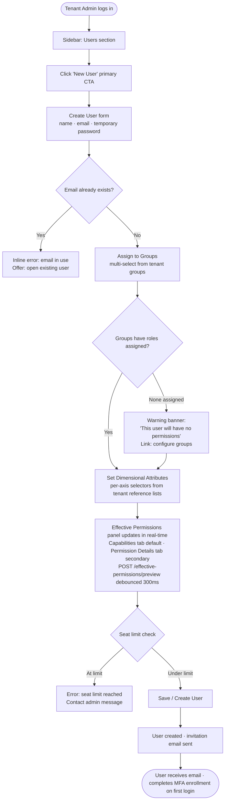
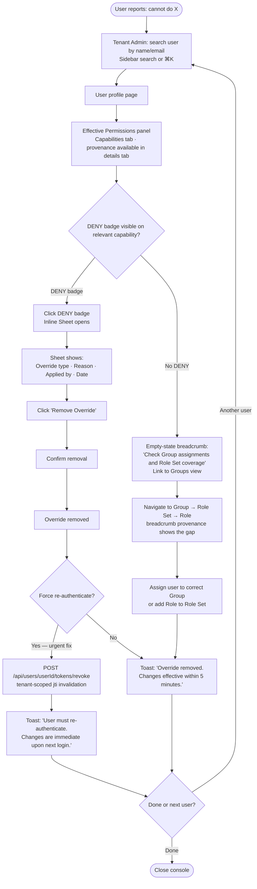
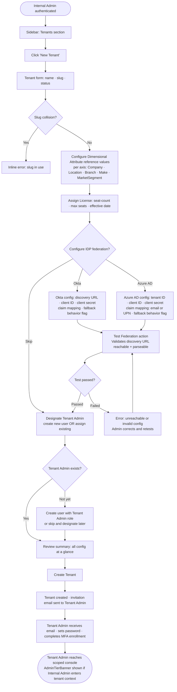
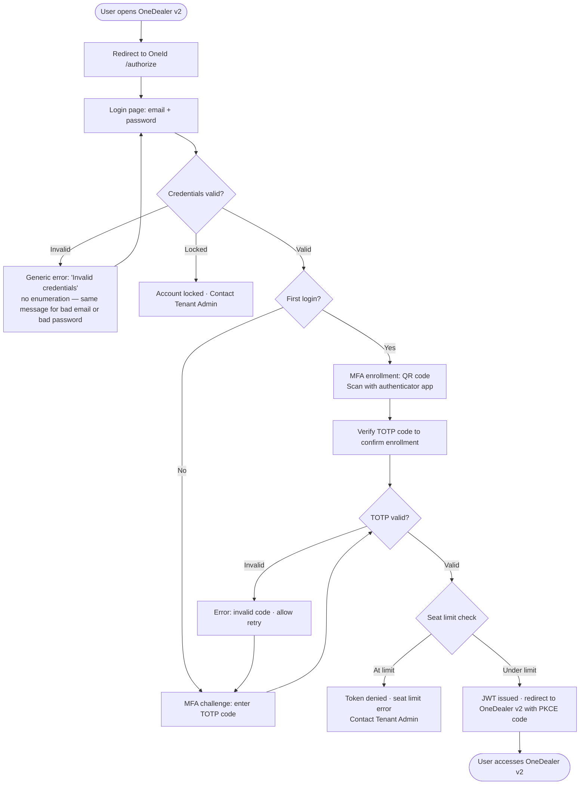
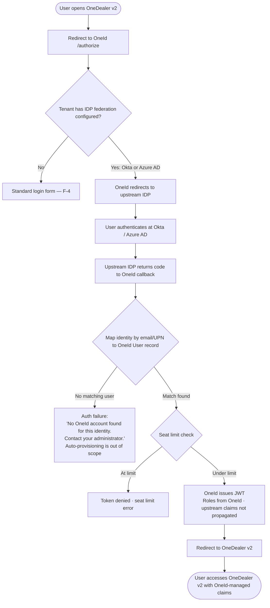

# UX Design Specification OneId

**Author:** Georgios.mathioudaki
**Date:** 2026-05-21

---

<!-- UX design content will be appended sequentially through collaborative workflow steps -->

## Executive Summary

### Project Vision

OneId is a custom IDP and licensing management console for OneDealer v2 — a car dealership software platform used across hundreds of dealerships. The management console is the primary user-facing investment: a two-tier React admin application serving Internal Admins (OneDealer ops team) and Tenant Admins (dealership IT managers). The authentication UI (login, MFA, password reset) is minimal and functional; the admin console is where the real UX work lives.

The core UX challenge is making a sophisticated authorization model — Users, Groups, Role Sets, Roles, Permissions, User-level Overrides, and five-axis Dimensional Attributes — manageable for a moderately technical dealership IT manager who is typically under time pressure, diagnosing access problems reactively.

### Target Users

**Internal Admin** — OneDealer ops/engineering team (~5–20 people). High technical literacy. Manages all Tenants globally: Permission catalog, Licenses, IDP federation configuration, Tenant Admin designation. Power user; uses Command Palette (⌘K) for fast navigation across many tenants.

**Tenant Admin** — Dealership IT manager or senior staff. Moderate technical literacy. Manages Users, Groups, Roles, Role Sets, and Dimensional Attribute assignments within their single Tenant. Primary console user. Two dominant workflows:
- **Reactive**: "Someone can't access something — diagnose and fix it fast." Starts from a person, works backward through the authorization chain.
- **Proactive**: "New employee starting Monday — set them up completely." Starts from a blank user, follows a linear setup flow.

Design target: **diagnostic workflows complete fast enough that context-switching is never forced.** Tasks are rapid and sequential, not parallel.

**Tenant User** — Dealership staff. Only interacts with the login/MFA flow. No management console interaction.

### Key Design Challenges

1. **Authorization model comprehension** — The chain (User → Groups → Role Sets → Roles → Permissions + User-level Overrides + Dimensional Attributes) is complex. Tenant Admins think in terms of people and what they can or can't do, not in terms of the model. The UI must show the *compiled result* (effective permissions) alongside the *source* (provenance chain), not just expose the model structure.

2. **Two-tier visual identity** — Internal Admin operating within a Tenant context must be clearly, persistently differentiated from a Tenant Admin session. Color alone fades with habitual use. Tenant name must appear in the command surface and in every destructive confirmation dialog, not just in a banner.

3. **Propagation delay honesty** — All permission, role, and dimension changes take up to 5 minutes to propagate (introspection cache TTL). The data itself must carry this uncertainty — not just a toast. Every mutation success state includes "Changes effective within 5 minutes."

4. **Dimensional Attribute assignment** — Five axes, multi-value per axis, server-authoritative validation. The UI must show the *compiled meaning* of assignments in plain language ("This user will see data from all branches in Bavaria belonging to ACME Group"), not just raw axis values.

5. **Deep hierarchy navigation** — Tenant → Groups → Users → Roles → Permissions. Search-first navigation preferred over browseable hierarchy for primary task paths. Hierarchy exposed for understanding, not as the default path to action.

### Design Opportunities

1. **Effective Permissions panel** — Inline, immediate read on any User showing the resolved permission set with full provenance chain. The single most trust-building feature in the console: admins verify their setup is correct before a user logs in, and diagnose access problems without navigating away.

2. **Command Palette (⌘K)** — Global search/navigate for Internal Admins managing many Tenants daily. Jump to any Tenant, User, or resource by name. The most-used feature for power users.

3. **Guided onboarding flows** — First-run empty states with "Create your first X" CTAs teach the authorization model through doing, not documentation.

4. **Compiled meaning preview** — Wherever the model produces a derived result (effective permissions, dimensional scope summary), show the output alongside the source. Reduces errors and support calls.

## Core User Experience

### Defining Experience

The core loop for **Tenant Admins** is: **find a user, understand their access state, act on it.** This applies to both reactive workflows (diagnose a problem) and proactive workflows (set someone up). Everything else — role management, permission catalog, dimension reference lists — is supporting configuration that happens occasionally.

The core loop for **Internal Admins** is: **navigate to the right Tenant quickly and make a targeted change.** The Command Palette (⌘K) is the primary navigation tool; the tenant hierarchy is context, not the primary path.

### Platform Strategy

- **Platform:** Web-only, desktop-first. This is an internal admin tool; no consumer mobile requirement.
- **Input:** Mouse and keyboard primarily. Power users rely on keyboard shortcuts (Command Palette, quick search).
- **Offline:** Not required. All operations require a live connection.
- **Device-specific capabilities:** None needed.

### Effortless Interactions

The following must require zero thought for experienced Tenant Admins:

- **Find any user in under 3 keystrokes** — global search from anywhere in the console, scoped to the current Tenant
- **Understand a user's access state at a glance** — Effective Permissions panel loads immediately on the User profile, no navigation required
- **Make a single targeted change without leaving the user page** — add a role, fix an override, adjust a dimension value inline
- **Switch tenants without losing context** — Internal Admin navigates between tenants and lands at the equivalent sub-path in the new tenant

What should happen automatically:
- Effective Permissions panel re-fetches after any mutation on the same user
- Panel visually dims after a change to communicate propagation delay without a separate message
- TanStack Query invalidates tenant-scoped data when the active tenant changes in the URL

### Critical Success Moments

1. **"I can see exactly what this person can and can't do, and why"** — Effective Permissions panel loads with full provenance chain. Admin can trace any permission back to its source (Group → Role Set → Role) or override (user-level ALLOW/DENY). This is the primary trust-building moment.

2. **"I made the change and I know it will take effect"** — Every mutation confirms with "Changes effective within 5 minutes." Admin closes the tab with confidence, not anxiety about whether the save worked.

3. **"I set up a new employee in under 10 minutes without calling anyone"** — Setup Wizard walks a Tenant Admin through a new user (role set assignment, dimensional attribute configuration) without requiring knowledge of the underlying authorization model.

4. **"I switched tenants and landed exactly where I expected"** — Internal Admin switches tenant context and URL-encoded state restores the correct sub-path. No disorienting reset to a dashboard.

### Experience Principles

1. **Show the compiled result, not just the source** — Everywhere the system derives a result (effective permissions, dimensional scope meaning), show the output alongside the input. Admins verify outcomes, not configurations.

2. **Honesty over false reassurance** — The 5-minute propagation delay, the dimming Effective Permissions panel, "Last resolved Xm ago" — these communicate truth. Never imply immediacy that doesn't exist in the system.

3. **Person-first navigation** — The primary path to any action starts with a person. Role management, permission management, and dimension configuration have their own first-class surfaces, but the admin's job always starts with "who."

4. **Progressive disclosure with an expert exit** — Hide complexity for first-time flows. Always provide a path to the full model (advanced mode) for experienced admins who don't need the guided experience.

5. **Destructive actions name their target** — Every delete, suspend, or override confirmation names the exact Tenant, User, Role Set, or entity being affected. No ambiguous "Are you sure?" dialogs.

## Desired Emotional Response

### Primary Emotional Goals

**Primary: Confidence and control.**

The Tenant Admin — under pressure, racing a clock, dealing with a blocked user — needs to feel like they are in command of the situation, not navigating a system they don't fully understand. Every design decision should ask: *does this make the admin feel more or less in control?*

For Internal Admins, the primary emotional goal is **efficiency and orientation** — knowing exactly where they are across many Tenants and being able to act precisely without second-guessing their scope.

### Emotional Journey Mapping

| Stage | Target emotion | Design mechanism |
|---|---|---|
| Opening the console | Oriented, not overwhelmed | Person-first search, clean entry point, no wall of options |
| Diagnosing a problem | Confident, focused | Effective Permissions panel with full provenance — "I can see exactly what's happening" |
| Making a change | Calm, deliberate | Progressive disclosure hides unnecessary complexity; expert mode available but not forced |
| After saving | Certain, not anxious | "Changes effective within 5 minutes" — honest and explicit, not vague. No mystery about whether the save worked. |
| Something goes wrong | Informed, not panicked | Clear error states with preserved work and explicit next action. Never a blank failure screen. |
| Returning after absence | Familiar, efficient | Consistent patterns across all flows; no surprises between sessions |

### Micro-Emotions

- **Trust over skepticism** — The Effective Permissions panel must show current truth. If the panel is stale or wrong, admins stop trusting the whole console. Provenance chain and propagation honesty are trust mechanics, not decorative features.
- **Accomplishment over frustration** — Each completed task (user set up, access fixed) should feel like a clean close. Durable success confirmation (not auto-dismissing toasts) creates that closure moment.
- **Calm over anxiety** — The 5-minute propagation delay could create anxiety ("did it work?"). The dimming panel with timestamp converts that anxiety into informed patience. Same underlying information, different emotional outcome.
- **Control over helplessness** — Every error must preserve the admin's work and offer a clear recovery path. Dead ends and silent failures are the fastest way to destroy confidence.

### Design Implications

**Emotions to explicitly avoid and the design choices that prevent them:**

- *Fear of mistakes* → Destructive confirmations always name the exact target (Tenant name, User name, entity being deleted). No ambiguous "Are you sure?" dialogs.
- *Confusion about scope* → AdminTierBanner persistent in tenant context; URL-encoded active tenant; "Operating as Internal Admin within [Tenant Name]" never ambiguous.
- *Helplessness at errors* → Server validation errors preserve form state and surface a clear recovery action. Optimistic rollback message is calm and instructive, not alarming.
- *Anxiety about propagation* → Effective Permissions panel dims visually after a mutation with "Last resolved Xm ago — updates propagating." The data carries the uncertainty, not a banner the admin will learn to ignore.

**Emotion → Design connections:**

- *Confidence* → Effective Permissions panel always accessible, provenance clickable through to the fix in one action
- *Trust* → Propagation delay surfaced in the data, never hidden; DENY overrides rendered as alarms, not list items
- *Calm* → Mutation feedback is durable and explicit; no auto-dismissing toasts for important state changes
- *Accomplishment* → Setup Wizard has a clear "done" moment; diagnostic fix has an explicit confirmation the change is in
- *Control* → Expert escape valve in wizard; DENY override actionable in one click; no dead ends in any flow

### Emotional Design Principles

1. **Honesty builds trust** — Surface the true state of the system (propagation delay, cache age, pending changes) rather than implying a certainty that doesn't exist. Admins under pressure can handle truth; they can't handle surprises.
2. **Closure at every task end** — Every workflow has a defined completion moment. The admin should never be left wondering whether they finished or not.
3. **Errors are recoverable, never catastrophic** — Error states preserve work, name the problem precisely, and offer a clear next step. The system never leaves the admin at a dead end.
4. **Power without intimidation** — The full authorization model is available to those who need it; hidden from those who don't. Complexity is earned through exploration, not imposed on entry.

## UX Pattern Analysis & Inspiration

### Inspiring Products Analysis

**Linear — keyboard-first command palette and entity navigation**
Linear's Command Palette (⌘K) is the gold standard for power-user navigation in dense admin tools. Everything is reachable by name in under 3 keystrokes — no hierarchical browsing required. The sidebar is persistent and context-aware but never the primary path. Directly applicable to OneId's Internal Admin navigating across many Tenants and the global Permission catalog.

**Vercel / Cloudflare — tenant-switching that preserves sub-path context**
Both products handle team/org switching with URL-encoded context, landing the user at the equivalent page in the new team rather than resetting to a dashboard. This is exactly the pattern needed for OneId's TenantSwitcher — switching Tenants while on `/users` lands on the new Tenant's `/users`. The visual treatment (org name in the persistent nav, clear scope indicator) also informs the AdminTierBanner pattern.

**GitHub org settings — readable two-tier permission scoping**
GitHub's organization/repository permission model presents a two-tier access structure (owner vs. member, org-level vs. repo-level) in a way that's readable without deep knowledge of the underlying model. Key pattern: permissions are always shown in terms of what the user *can do* at each level, not in terms of the permission data structure. The "outside collaborator" vs. "member" distinction is a clean analogue to OneId's Internal Admin vs. Tenant Admin tier split.

**Retool — permission model visualization**
Retool's permission UI shows group/role membership alongside the access that membership grants — the compiled result alongside the source. Users can trace "this person has edit access to X because they're in group Y which has role Z." This is the closest analogue to OneId's Effective Permissions provenance chain pattern.

### Transferable UX Patterns

**Navigation patterns:**
- *Command Palette (Linear)* — global ⌘K search/navigate for Internal Admins; jump to any Tenant, User, or resource by name; critical for power users managing many Tenants daily
- *URL-encoded context with sub-path preservation (Vercel/Cloudflare)* — tenant-switch preserves the current page within the new Tenant's context; browser history and deep links work fully
- *Persistent scoped sidebar (GitHub org settings)* — adapts content per tier; Internal Admin sees global resources + all Tenants; Tenant Admin sees only their Tenant's resources

**Interaction patterns:**
- *Compiled result alongside source (Retool)* — Effective Permissions panel shows the resolved permission set with provenance chain; Dimensional Attribute assignments show plain-language meaning alongside raw values
- *Progressive disclosure with expert mode (GitHub)* — simple flows for common tasks; full model accessible for power users who need it
- *Durable success confirmation (Linear)* — task completion is explicit and persistent; not an auto-dismissing toast

**Visual patterns:**
- *Persistent context indicator (Vercel team switcher)* — AdminTierBanner and tenant name are permanently visible when Internal Admin is in tenant context; never rely on color alone
- *Neutral loading skeletons (shadcn/ui)* — genuinely ambiguous during permission resolution; no content preview before access is confirmed

### Anti-Patterns to Avoid

- **AWS IAM — no compiled result view** — IAM shows the policy structure but not the effective access for a given user without running a simulation tool. OneId must never require a separate "simulate" step to understand what a user can do. The Effective Permissions panel must be the default view, not an advanced feature.
- **Modal-heavy admin consoles** — Every action requiring a full-screen modal interrupts context and slows reactive workflows. Prefer inline panels and slide-overs that preserve the user's place.
- **Ambiguous save states** — Auto-dismissing toasts ("Saved!") for changes with a 5-minute propagation delay create false confidence and support tickets. Durable success states with explicit propagation context are required.
- **Flat permission lists without grouping** — Showing 50+ permissions as an unsorted list is unusable. Permissions must be grouped semantically (by module, by resource type) with provenance callouts.
- **Hierarchy-first navigation** — Forcing admins to browse Tenant → Groups → Roles → Permissions to reach a specific entity. Search-first is the primary path; hierarchy is for understanding, not action.

### Design Inspiration Strategy

**Adopt directly:**
- Linear's Command Palette pattern for Internal Admin global navigation
- Vercel's URL-encoded tenant context with sub-path preservation on switch
- Retool's provenance-alongside-result pattern for the Effective Permissions panel
- shadcn/ui's neutral skeleton pattern for permission-gated content

**Adapt for OneId's context:**
- GitHub's two-tier permission readability — adapt to show OneId's deeper chain (Group → Role Set → Role → Permission) without losing readability; use collapsible provenance rows rather than flat display
- Linear's keyboard-first patterns — adapt for a less keyboard-heavy Tenant Admin persona; Command Palette is primarily for Internal Admins, not required for Tenant Admin flows

**Avoid:**
- AWS IAM's "simulate to understand" pattern — Effective Permissions must be always-on, not a feature to invoke
- Any design that requires the admin to understand the authorization model to navigate the UI — person-first always

## Design System Foundation

### Design System Choice

**shadcn/ui + Tailwind CSS** — decided during the architecture session.

### Rationale for Selection

- **No dependency lock-in** — shadcn/ui components are copied into the project, not consumed from a versioned package. The team owns the code and can extend any component (e.g., DataTable with custom column renderers for the Effective Permissions panel) without fighting a library API.
- **Best fit for admin consoles** — the component catalog covers exactly what a dense admin tool requires: `DataTable`, `Command` (Command Palette), `Sheet` (slide-over panels), `Dialog`, `Form`, `Select`, `Badge` — all consistent and accessible by default.
- **Tailwind utility-first approach** — context-specific visual treatments (AdminTierBanner, DENY override badge, propagation-dimming state) are straightforward without fighting style encapsulation.
- **shadcn/ui `Command` component** — directly implements the Linear-style ⌘K Command Palette identified as a core navigation pattern. No custom implementation required.
- **Accessibility included** — built on Radix UI primitives; ARIA patterns for dialogs, dropdowns, and keyboard navigation are correct by default.

### Implementation Approach

- Initialize with `npx shadcn@latest init` (already in the architecture bootstrap sequence — Story 1)
- Add components on demand as features are built; no bulk install
- Design tokens (colors, spacing, typography) via Tailwind CSS variables in `globals.css`
- Stack: Vite 6 + React 19 + TypeScript strict + shadcn/ui + TanStack Query + TanStack Table + React Router v7

### Customization Strategy

| Element | Customization | Mechanism |
|---|---|---|
| AdminTierBanner | Distinct amber/warning background when Internal Admin is in tenant context | Tailwind semantic token — never inline value |
| DENY override badge | Hard red (`destructive` token), visually distinct from normal permission provenance badges | shadcn `Badge` variant |
| Propagation-dimming state | `opacity-60 transition-opacity` on Effective Permissions panel after mutation; restored after re-fetch | Tailwind utility + TanStack Query state |
| Mutation feedback — durable | `Toast` variant that does not auto-dismiss for the 5-minute propagation message | Extended shadcn `Toast` with `durable` prop |
| Neutral loading skeleton | Genuinely ambiguous skeleton during permission resolution — no content preview | shadcn `Skeleton` component |

## 2. Core User Experience

### 2.1 Defining Experience

**"Find a person, see exactly what they can access and why, fix it in one place."**

This is the interaction that, if nailed, makes everything else follow. A Tenant Admin at 8:47am should be able to open the console, find a user, read their full access state in one glance, make the change, and close the tab — without navigating to a separate role page, a separate permissions page, or calling support.

### 2.2 User Mental Model

Today, dealership IT managers solving access problems work against a fragmented model: they know a person and a symptom ("Lucas can't see the finance tab") but have no tool that connects those two things to a root cause. The OneId console must be the first tool where the answer to "why can't this person do X?" is immediately visible — not derivable after multiple navigation steps.

The mental model admins bring: **person → problem → fix.** Not **model → entity → assignment.** The UI must match that direction of travel.

### 2.3 Success Criteria

The core interaction succeeds when:
- The User profile page loads with Effective Permissions visible without any extra clicks
- Any permission or dimension problem is diagnosable from a single page in under 60 seconds
- Any single targeted fix (assign a Role Set, add a Permission Override, adjust a dimension value) completes inline — no navigation away from the user page
- After saving, the admin has explicit confirmation the change is queued, with honest propagation timing ("effective within 5 minutes")
- If a DENY override is the cause of an access block, it is both visually distinct (red badge) and one click away from being resolved

### 2.4 Novel UX Patterns

Most mechanics are **established patterns combined innovatively**:

| Element | Pattern type | Source |
|---|---|---|
| Global search / Command Palette | Established | Adopted directly (Linear) |
| Person-centric drill-down | Established | Adopted, refined |
| Inline editing without navigation away | Established | Adopted (Notion, Linear) |
| **Effective Permissions with clickable provenance chain** | **Novel** | OneId-specific |
| Propagation delay surfaced in the data itself | Novel | OneId-specific |
| Plain-language dimensional scope summary | Novel | OneId-specific |

The Effective Permissions panel is the genuinely new pattern. No mainstream admin console shows the compiled authorization result with a full, interactive provenance chain in an inline panel. This is the design bet — the interaction that makes Tenant Admins say "this is how it should have always worked."

### 2.5 Experience Mechanics

**The core flow: diagnosing and fixing an access problem**

**Initiation**
Admin searches the user's name via global search or ⌘K Command Palette. Result appears immediately, scoped to the current Tenant. One click opens the User profile.

**Reading the state**
User profile loads with two primary panels:
- *Left:* User details + Group/Role Set assignments (the *source* — what's configured)
- *Right:* Effective Permissions panel (the *compiled result*) — full permission list grouped by module, with provenance badges on each entry tracing it back to Group → Role Set → Role. Dimensional Attribute summary below with plain-language compiled meaning. DENY overrides rendered as hard red badges, visually distinct from normal entries.

Admin scans the right panel. If something is wrong, they see it immediately: missing permission, unexpected DENY badge, or a dimension mismatch.

**Fixing the problem**
Admin clicks the DENY badge, missing permission entry, or dimension value. Inline action panel slides in (shadcn `Sheet`) showing exactly what controls the issue and offering the fix in place:
- Remove a DENY override → one button
- Assign a Role Set that grants the missing permission → search + assign inline
- Adjust a dimension value → axis picker inline

No navigation away from the User profile page.

**Feedback**
Save triggers durable success message: "Change saved — effective within 5 minutes." Effective Permissions panel dims with timestamp ("Last resolved Xm ago — updates propagating"). Admin can see the pending state clearly and can close the tab with confidence.

**Completion**
Task is explicitly closed. Admin navigates to the next user or closes the tab. No ambiguity about whether the fix is in.

## Visual Design Foundation

### Color System

**Approach:** Neutral-professional with clear semantic signals. No existing brand guidelines — clean-slate build aligned with OneId's emotional goals of confidence, trust, and calm.

| Role | Color | Rationale |
|---|---|---|
| Base / neutral | Slate grays (shadcn default) | Clean, not cold; reduces visual fatigue in dense data views |
| Primary accent | Indigo/blue | Conveys trust and authority; consistent with best-in-class B2B admin tools |
| AdminTierBanner | Amber (warning tone) | Visible, non-alarming "elevated context" signal; clearly distinct from error states |
| DENY override badge | Red (destructive token) | Hard stop, non-negotiable visual signal; must not be ignorable |
| Success / propagation confirmed | Muted green (subdued) | Change confirmed but calm — not celebratory; paired with "effective within 5 minutes" copy |
| Neutral loading skeleton | Mid-gray | Genuinely ambiguous; no content preview before permission resolves |

Dark mode supported via Tailwind `dark:` variant; shadcn/ui defaults handle the base palette inversion.

### Typography System

**Typeface:** Inter (shadcn/ui default) — single family, no pairing complexity needed for an admin tool. Dense, readable, excellent at small sizes in data-heavy views. Alternative: Geist (Vercel) for a more modern, monospace-adjacent character.

**Type scale:** Tight hierarchy appropriate for admin consoles:

| Level | Size | Weight | Usage |
|---|---|---|---|
| Page title | 24px / 1.5rem | 600 | Section headers |
| Section heading | 18px / 1.125rem | 600 | Card headers, panel titles |
| Body | 14px / 0.875rem | 400 | Primary content, table cells |
| Label / caption | 12px / 0.75rem | 500 | Form labels, meta info, timestamps |
| Monospace | 13px / 0.8125rem | 400 | Permission IDs, user IDs, JWT claims |

**Tabular numerals** enabled for all numeric data — seat counts, timestamps, pagination counts.

### Spacing & Layout Foundation

**Base unit:** 4px, primary rhythm 8px. Admin consoles are data-dense; white space is earned by content importance, not decorative.

**DataTable rows:** Compact by default (32px row height), comfortable mode available (40px) — user preference stored in local state.

**Layout:** Persistent left sidebar + right content area.
- Sidebar width: 240px; collapses to icon-only (56px) on smaller viewports
- Content area: max-width 1280px for readability on ultra-wide monitors; full-bleed DataTables within that constraint
- AdminTierBanner: full-width strip above the sidebar+content layout; 40px height; present on all pages when Internal Admin is in tenant context

**Grid:** 12-column within content area for form layouts; DataTables and panels use full available width.

### Accessibility Considerations

- All color combinations must meet WCAG 2.1 AA contrast (4.5:1 for body text, 3:1 for large text and UI components)
- DENY badge red must pass contrast against both light and dark backgrounds — use shadcn `destructive` token which is designed for this
- AdminTierBanner amber must not rely on color alone — include an explicit text label ("Internal Admin context") as the primary signal
- Focus indicators: shadcn/ui Radix primitives provide keyboard focus rings by default; do not suppress them
- Skeleton loading states: ensure screen readers receive appropriate `aria-busy` or `aria-label` on loading regions
- Tabular numerals prevent layout shift when numbers update in real time (seat counts, timestamps)

### Open Items to Resolve During UX Design

- DENY overrides must be clickable through to the fix, not just visually flagged
- Diagnostic view needs a "next user" affordance for audit/batch workflows
- Dimension summary needs truncation strategy and "view full breakdown" escape hatch for complex assignments
- Setup Wizard needs an expert "advanced mode" escape valve for experienced Tenant Admins
- Error state design for server validation rejections and silent failures — currently unspecified
- `/effective-permissions` API must return provenance chain — backend contract needed before UI work starts
- Bulk user operations — explicit v1 scope decision or deferral with documented workaround
- Audit history placement — accessible from User profile page in v1? (FR-22 exists; placement unspecified)

---

## Design Direction Decision

### Design Directions Explored

Six directions were evaluated: Professional Dark Sidebar, Tabbed Light Shell, Dark Mode / Command-Centric, Compact Dense, Setup Wizard / Guided Flow, and Module Card Groups. All directions were built against the established visual and experience foundation and reviewed in a multi-perspective session with UX, Architecture, and Product stakeholders.

### Chosen Direction

**Direction 3 — Dark Mode / Command-Centric**, with two refinements from the review session:

1. **Navigation model:** Persistent left sidebar is the *primary* navigation surface. The ⌘K Command Palette is an *acceleration layer* for power users, not the entry point. Novice users (Tenant Admins logging in once or twice a week) must be able to complete all core tasks by reading and clicking — no keyboard shortcut knowledge required.

2. **Permission namespace:** Unified `od.` prefix for all permission IDs (e.g., `od.crm.invoice.create`). No product module separation at the namespace level (`crm.`, `erp.` prefixes dropped). Module-level grouping is a UI/tag concern, not encoded in the ID string.

### Design Rationale

Dark mode suits an IT-focused admin tool used in extended sessions. The zinc palette with indigo accent reads as a professional, purpose-built system rather than a consumer app. DENY states using `red-500` on `red-950` are appropriately high-signal.

The sidebar-primary / ⌘K-secondary pattern directly addresses the two-user reality: Tenant Admins (moderate technical literacy, infrequent sessions) navigate visually; Internal Admins (high technical literacy, multi-tenant power users) accelerate via keyboard. The same UI serves both without compromising either.

Unified `od.` namespace removes a governance problem — permission scope boundaries are a UI/data concern (category tags), not a naming convention concern. Avoids the risk of cross-module permission duplication or awkward namespace ownership debates.

### Implementation Approach

**Color tokens (semantic contract — define in `globals.css`, not ad-hoc Tailwind):**

| Semantic role | Token | Tailwind value |
|---|---|---|
| App background | `--background` | `zinc-950` |
| Sidebar | `--sidebar` | `zinc-900` |
| Card / panel surface | `--card` | `zinc-800` |
| Elevated overlay (Sheet, Dialog) | `--popover` | `zinc-800` |
| Primary accent | `--primary` | `indigo-500` |
| Destructive / DENY | `--destructive` | `red-500` / `red-950` bg |
| AdminTierBanner | custom | `amber-600` bg, `zinc-950` text |
| Permission ID monospace | custom | `indigo-300` |

**Navigation architecture:**
- Persistent left sidebar (240px, icon-only collapse at 56px) — primary navigation for all users
- ⌘K Command Palette — secondary accelerator; scoped to: navigation shortcuts, user/group/tenant search, quick actions (Internal Admin). Not a multi-step workflow surface.
- Breadcrumbs — always present in content area; provide spatial orientation
- React Router v7 nested layouts encode active tenant in URL as source of truth

**Permission IDs:**
- All IDs use `od.` prefix universally
- Category/module grouping stored as a `category` data attribute on `Permission` records (e.g., `crm`, `erp`, `inventory`) — drives filtering and grouping in Permission Matrix and ⌘K search
- `indigo-300` monospace rendering in all permission ID display contexts

**Accessibility obligations before shipping:**
- Validate `amber-600` bg + `zinc-950` text on AdminTierBanner against WCAG AA (4.5:1)
- Validate `indigo-300` monospace on `zinc-800` at 13px/400 weight — check actual rendered contrast, not just hex values
- Validate `red-500` text on `red-950` DENY badge at small sizes (11–12px in Permission Matrix grid)
- Third-party component dark mode support must be verified before integration (date pickers, any grid/chart library)

---

## User Journey Flows

### F-1: Tenant Admin — Onboard New Employee (UJ-2)

The most frequent Tenant Admin workflow. Sidebar-first; no keyboard shortcut knowledge required.

**POC decisions:**
- Effective Permissions panel shows a real-time preview **before save**, using a diff-based `POST /effective-permissions/preview` endpoint
- Panel defaults to a **Capabilities tab** (human-readable labels, e.g. "View finance reports · Approve purchase orders") with a secondary **Permission Details tab** (raw `od.` IDs + provenance) for power users
- Capability labels are maintained in a frontend-owned TS label map; backend maintains a canonical permission constants file as the migration path to a future `PermissionMetadata` table
- Preview is debounced (300–500ms); TanStack Query cancel-on-new-request pattern



**Entry point:** Sidebar → Users → "New User"
**Success signal:** Green toast "User created. Invitation sent to [email]."
**Seat indicator:** Users section header shows "X / Y seats used" at all times — admin sees remaining capacity before attempting to add users.

---

### F-2: Tenant Admin — Diagnose & Fix Access Issue (Reactive)

Design goal: diagnosis + fix completable in under 2 minutes. Sequential, not parallel.

**POC decisions:**
- DENY badge is the click target → inline Sheet → one "Remove Override" button → confirm
- **Force Re-authenticate** action available after removing an override: calls `POST /api/users/{userId}/tokens/revoke` (tenant-scoped jti invalidation). Toast message varies: "Changes effective within 5 minutes" (no revocation) vs. "User must re-authenticate — changes are immediate" (revocation triggered)
- Empty state of Effective Permissions panel when user has no DENY but something seems wrong: breadcrumb text "Not seeing the expected access? Check Group assignments and Role Set coverage." with link to Groups view
- Full "search by what the user is trying to do" diagnostic mode is v2



**Entry point:** Sidebar → Users → search / ⌘K / direct URL
**Success signal:** Toast with accurate timing message (immediate or 5 minutes based on whether revocation was triggered).

---

### F-3: Internal Admin — Provision New Tenant (UJ-1)

Lower frequency, higher complexity. No wizard — Internal Admins are power users.

**POC decisions:**
- IDP federation config includes: OIDC discovery URL or SAML metadata, client ID/secret, claim mapping (email/UPN → OneId identity), fallback behavior flag (local credential fallback if upstream IDP unreachable)
- **Test Federation** action before committing tenant creation: validates discovery URL is reachable and parseable — broken configs are not discovered at first user login
- Tenant provisioning closes the loop with Tenant Admin first login (invitation → first login → reaches tenant console)



**Entry point:** Sidebar → Tenants → "New Tenant"
**Demo sequencing note:** If F-5 (federated auth) is in scope for the POC demo, at least one tenant provisioned in F-3 must have IDP federation configured.

---

### F-4: Standard Authentication (UJ-3)

Minimal UI — functional, not a design investment. Auth surface is a thin layer; the console is the investment.

**POC done state:** A successful login returns a JWT with expected `roles`, `sub`, `iss`, `jti` claims. Token is decodable in a browser and matches the user's role assignments configured in the console.



---

### F-5: Federated Authentication (UJ-4)

IDP chaining path. OneId issues its own JWT regardless of upstream IDP claims — upstream authenticates identity, OneId owns all authorization.

**POC done state:** A federated user at a configured tenant completes Okta or Azure AD login and receives a OneId JWT containing their OneId-managed roles — not upstream roles. The JWT is identical in structure to a standard auth JWT.



---

### Journey Patterns

**Sidebar-first navigation:** All admin console journeys begin with the persistent sidebar. ⌘K is available as an accelerator at every step but never the only path. No journey requires keyboard shortcut knowledge.

**Provenance always available:** Whenever a permission or capability is displayed, the source chain (User → Group → Role Set → Role → Permission) is accessible in the Permission Details tab. Click any node in the chain to navigate directly to it.

**Effective Permissions panel — two-tab pattern:**
- **Capabilities tab (default):** Human-readable capability labels, frontend label map, grouped logically. The view a Tenant Admin trusts.
- **Permission Details tab:** Raw `od.` permission IDs with full provenance. The view a power user needs for auditing.

**Mutation feedback pattern:** Every write follows: pending spinner → durable success toast → "Changes effective within 5 minutes" note for permission-related changes. For force-revocation actions: "User must re-authenticate — changes are immediate."

**Seat visibility pattern:** Seat usage ("X / Y seats used") is displayed persistently in the Users section header — proactive, not reactive. Error gates remain at token issuance; the indicator prevents surprises.

**Error inline pattern:** Form errors appear inline next to the field. System errors (seat limit, locked account) appear as full-card states with a named next action ("Contact Tenant Admin", "Retry").

**Sequential task pattern:** One task at a time. After completing a fix in F-2, the admin is offered "next user" or "done" — no task queue, no parallel management surface.

---

### Flow Optimization Principles

- **Minimize steps to value:** F-2 is 4 clicks from search to confirmed fix.
- **Preview before commit:** F-1 shows resolved capabilities before saving — catches misconfiguration without a separate diagnostic session.
- **No knowledge required to start:** Every journey has a visible entry point in the sidebar. ⌘K is never the only way.
- **Error messages name the next action:** "Contact Tenant Admin" not "Access denied." "Slug in use" not "Validation error."
- **Propagation delay is explicit and accurate:** "5 minutes" is displayed as a feature. Force Re-authenticate is the escape valve for urgent cases.
- **Trust through readability:** Default views use human-readable labels. Raw IDs are one tab away, never hidden.

---

### Deferred to v2

- **"Missing Access" diagnostic mode:** Type what the user is trying to do, get a plain-language explanation of why they lack access. POC provides an empty-state breadcrumb as a minimal substitute.
- **`/effective-permissions/preview` full hypothetical payload:** POC uses diff-based endpoint (pending changes against saved state). Full unsaved-object preview is v2.
- **Job-function taxonomy grouping in Capabilities tab:** POC uses a flat readable list. Grouped-by-job-function view is v2.

---

## Component Strategy

### Design System Components (shadcn/ui — direct use or thin extension)

| shadcn component | OneId usage |
|---|---|
| `Button` | All primary / secondary / destructive actions |
| `Input`, `Form`, `Label` | All form fields |
| `Select`, `Combobox` | Group selection, dimension assignment, TenantSwitcher |
| `Checkbox`, `Switch` | Bulk selection in DataTable, toggle flags (IDP fallback) |
| `Table` | Base for `DataTable` — extended with TanStack Table v8 |
| `Sheet` | DENY override panel, config side panels |
| `Dialog` | Destructive confirmations (delete group, remove override) |
| `Tabs` | `EffectivePermissionsPanel` two-tab pattern |
| `Badge` | DENY badges, status indicators, role tags |
| `Command` | Base for `CommandPalette` |
| `Breadcrumb` | Page breadcrumbs, base tokens for `ProvenanceChain` |
| `Toast` / Sonner | `MutationFeedback` |
| `Skeleton` | Loading states on all data-fetching panels (Phase 1) |
| `Alert` | Warning banners (no-permissions warning in F-1) |
| `Tooltip` | Permission ID on hover in Capabilities tab |
| `ScrollArea` | Sidebar, long permission lists |

### Custom Components

#### `AdminTierBanner`
**Purpose:** Signals to Internal Admin that they are operating within a specific tenant context — prevents accidental cross-tenant modifications.
**Anatomy:** Full-width strip, 40px height, above sidebar+content layout. `amber-600` bg, `zinc-950` text. Content: "Internal Admin — Tenant: [Name] / [Current Section]" (breadcrumb-style context). Action: "← All Tenants" button (not "Exit" — unambiguous destination).
**States:** Visible when Internal Admin has active tenant context in URL; hidden otherwise.
**Behaviour:** If unsaved changes exist in the tenant context, "← All Tenants" triggers a confirmation dialog before navigating. This prevents accidental data loss.
**Accessibility:** `role="alert"` or `role="status"`. Color not the sole signal — explicit text label required. WCAG AA contrast required: test `amber-600` bg + `zinc-950` text before shipping.

---

#### `EffectivePermissionsPanel`
**Purpose:** Shows a user's resolved authorization state. Used for onboarding preview (F-1) and diagnostic review (F-2).
**Architecture:** Shell component (tabs, layout, loading states) + two independent data hooks:
- `useEffectivePermissionsLive(userId)` — standard TanStack Query GET
- `useEffectivePermissionsPreview(payload)` — debounced POST (300–500ms), cancel-on-new-request

**Props (discriminated union — TypeScript enforced):**
```ts
type EffectivePermissionsPanelProps =
  | { mode: 'live'; userId: string }
  | { mode: 'preview'; userId: string; previewPayload: PreviewPayload };
```

**Tab 1 — Capabilities (default):**
- Human-readable capability labels from frontend label map
- Tooltip on hover reveals underlying `od.` permission ID
- DENY badge inline on any denied capability
- Cross-tab search input at top of panel: typing `od.crm` filters Capabilities AND switches to Permission Details tab if needed — bridges support-call scenario
- Tab selection persisted per session (Internal Admins default to last-used tab)

**Tab 2 — Permission Details:**
- Raw `od.` permission IDs with `ProvenanceChain` for each
- Full chain always visible on this tab (no "..." truncation) — horizontal scroll if overflow
- DENY badges are click targets opening `DenyOverrideSheet`

**Empty states (three distinct states — different copy and CTA for each):**
1. *No roles assigned:* "This user has no group assignments. Add them to a group to grant permissions." → CTA: "Manage Group Assignments"
2. *Groups assigned but role sets have no permissions:* "This user's groups exist but contain no permissions. Review the role sets assigned to their groups." → CTA: "View Groups"
3. *DENY blocking all access:* "All permissions are blocked by a DENY override. Click the DENY badge to review and remove it." → DENY badge visible inline

**States:** Loading (Skeleton rows), populated, preview mode (subtle "Preview" chip in panel header), error.
**Accessibility:** `aria-live="polite"` on preview updates. Full keyboard navigation for tabs and chain links.

---

#### `DenyOverrideBadge` + `DenyOverrideSheet`
**Purpose:** Surface and remediate terminal DENY overrides inline.
**Badge:** `red-500` text on `red-950` bg. Label: "DENY". Cursor: pointer. `aria-label="DENY override — click to review"`.
**Sheet (shadcn `Sheet` extended):**
- Header: override permission label
- Override type, reason, applied by (user), date applied, optional expiry
- "Remove Override" destructive Button
- "Force Re-authenticate" secondary Button — **permission-gated**: hidden if the current admin lacks the `od.admin.users.revoke` permission; shown-disabled-with-tooltip if they have partial access. Never shown-then-failed.
**States:** Default, removing (pending), removed (sheet closes, correct toast fires).

---

#### `SeatUsageIndicator`
**Purpose:** Proactive seat consumption visibility — admin sees remaining capacity before attempting to add users.
**Anatomy:** Inline label in Users section header: "42 / 50 seats used". Color: `zinc-400` (normal) → `amber-400` (≥80%) → `red-400` (100%). At 100%: tooltip "Seat limit reached. Contact your administrator to expand your license."
**Action propagation:** When at 100%, the "New User" primary CTA in the Users section is disabled with an inline tooltip referencing the seat limit. The error does not appear for the first time at the confirmation step.
**Accessibility:** Color changes accompanied by icon — not color-only signal.

---

#### `ProvenanceChain`
**Purpose:** Shows the authorization source chain for a permission. Each node is a navigation link.
**Anatomy:**
- On **Capabilities tab**: collapsed to source label only — "via Group: Fleet Managers" (single chip, click navigates to group). Minimal, non-distracting.
- On **Permission Details tab**: full chain always shown — User → Group → Role Set → Role → Permission. Horizontal scroll on overflow. Chains of 5+ nodes offer a "Show full chain ↓" expand (vertical reveal) rather than "..." truncation. The collapsed middle is the diagnostic information — never hide it.
**Chips:** `zinc-700` bg, `zinc-300` text, `›` separators. Hover: `indigo-500` border.

---

#### `GlobalNav`
**Purpose:** Persistent left sidebar — primary navigation surface for all users. Novice entry point.
**Anatomy:**
- Logo / wordmark at top
- Tenant context label (Tenant Admin: their tenant name; Internal Admin: "All Tenants" or current tenant if in context — mirroring `AdminTierBanner` context)
- Navigation items with lucide icons, `aria-current="page"` on active item
- Active state: `indigo-500` 2px left border + `zinc-800` bg
- Navigation items by tier — Tenant Admin: Users, Groups, Roles, Role Sets, Audit Log; Internal Admin adds: Tenants, Permissions, Licenses
- `TenantSwitcher` at bottom (Internal Admin only)
- ⌘K hint at very bottom ("Press ⌘K to search")
**States:** Expanded (240px), icon-only collapsed (56px, persisted in `localStorage`).
**Tenant context (source of truth):** Active tenant is encoded in URL params (`/tenants/:tenantId/...`). `GlobalNav` reads from URL. `TenantSwitcher` is a router navigation action — it navigates, not a Zustand write. Zustand caches the resolved tenant object from TanStack Query for convenience; URL is always authoritative.

---

#### `CommandPalette`
**Purpose:** Acceleration layer for power users. Keyboard-first fast path for known actions — not a replacement for `GlobalNav`.
**Trigger:** `⌘K` (Mac) / `Ctrl+K` (Windows). Also a visible button in `GlobalNav` footer for discoverability.
**Action registry:** Structurally enforced via TypeScript. Registry only accepts:
```ts
type PaletteAction = NavigationAction | EntitySearchAction | QuickAction;
// QuickAction = single async fn, no intermediate UI state
// Actions needing a form/confirmation must navigate to a page or open a Sheet
```
Multi-step workflows cannot be registered — enforced at the type level, not in documentation.
**Groups:** Navigation shortcuts, Users, Groups, Tenants (Internal Admin), Recent.
**Recent:** Recent navigations only, capped at 5, stored in `localStorage`. Per-tenant scoping for Internal Admins (switching tenants clears recent list). Scope is strictly navigations — not recent users viewed.
**Tenant context awareness:** Results and actions are scoped to the current tenant context. Tenant-scoped results show "in [Tenant Name]" tag when Internal Admin is in a tenant context.
**States:** Closed, open (empty prompt), open (results), open (loading).
**Accessibility:** `role="dialog"`, `aria-modal="true"`. Focus locked. Escape closes. Arrow keys navigate results.

---

#### `MutationFeedback` (hook: `useFormMutation`)
**Purpose:** Consistent feedback for all write operations. Implemented as a custom hook wrapping TanStack Query mutation — not a visual component.
**Interface:**
```ts
interface MutationMessages {
  success: string;
  error: string | ((err: unknown) => string);
  propagationNote?: string; // renders "Changes effective within 5 minutes" when present
}
```
**Pattern:** Button enters pending state → on success: durable Sonner toast with `propagationNote` if provided → on error: inline form error (validation) or error toast (system error). `onSuccess` / `onError` TanStack Query callbacks remain passable through the hook — not swallowed.
**Toast variants:**
- Standard mutation: durable success, auto-dismiss error
- Permission change (with `propagationNote`): appends "Changes effective within 5 minutes."
- Force revocation: message injected as "User must re-authenticate — changes are immediate."

---

#### `EmptyState`
**Purpose:** Standardized empty states across DataTables, panels, and search results.
**Anatomy:** Centered in container — lucide icon (`zinc-600`), title (bold), description (named next action), optional primary CTA.
**Variants:** No data (first time), no search results, no permissions (three distinct states per `EffectivePermissionsPanel` spec above), error.
**Content rule:** Description must name a next action — "Add your first user" not "No users found."

---

#### `DataTable`
**Purpose:** Reusable table with sort and pagination for all entity list views (Users, Groups, Roles, Tenants, Permissions).
**Props (Phase 1 contract):**
```ts
type DataTableProps<TData, TValue> = {
  columns: ColumnDef<TData, TValue>[];
  data: TData[];
  isLoading?: boolean;        // renders Skeleton rows when true
  pagination?: {
    pageIndex: number;
    pageSize: number;
    total: number;
    onPaginationChange: OnChangeFn<PaginationState>;
  };
};
```
**Filtering:** Lives at the page level in Phase 1 — each list view's filter shape is different. Not inside `DataTable`. Push filtering into the component later once the pattern is clear.
**Sorting:** Client-side in Phase 1 (TanStack Table `getSortedRowModel`). Server-side sorting is opt-in via `onSortingChange` + `manualSorting` when needed.
**Skeleton rows:** `isLoading` renders N skeleton rows using shadcn `Skeleton` in cell renders. Wired from Phase 1 — not deferred.

### Frontend Permission Label Map

**Structure:** Grouped data with a derived flat lookup — single source of truth:

```typescript
// permissions/registry.ts
export type PermissionGroup = {
  label: string; // e.g. "Vehicle Management"
  permissions: {
    id: string;  // e.g. "od.vehicles.read"
    label: string; // e.g. "View Vehicles"
    description?: string; // tooltip copy
  }[];
};

export const PERMISSION_GROUPS: PermissionGroup[] = [ /* ... */ ];

// Derived — never maintained separately
export const PERMISSION_LABELS = Object.fromEntries(
  PERMISSION_GROUPS.flatMap(g => g.permissions.map(p => [p.id, p.label]))
);

export function getPermissionLabel(id: string): string {
  return PERMISSION_LABELS[id] ?? id; // surface raw ID as fallback — never blank
}
```

**Maintenance contract:** When the backend adds a new `od.*` permission constant, the same PR must add an entry to `PERMISSION_GROUPS`. Validated at test time: `PermissionCatalogSyncTests.cs` on the backend; a matching frontend test asserts every backend constant has a `PERMISSION_GROUPS` entry.

### Query Key Factory

Defined before the first query is written. Missing a tenant ID from a key after a tenant switch = stale data that looks like a bug:

```typescript
// queries/keys.ts
export const queryKeys = {
  users: (tenantId: string) => ['users', tenantId] as const,
  user: (tenantId: string, userId: string) => ['users', tenantId, userId] as const,
  groups: (tenantId: string) => ['groups', tenantId] as const,
  effectivePermissions: (userId: string) => ['effective-permissions', userId] as const,
  effectivePermissionsPreview: () => ['effective-permissions', 'preview'] as const,
  tenants: () => ['tenants'] as const,
  tenant: (tenantId: string) => ['tenants', tenantId] as const,
  seatUsage: (tenantId: string) => ['seat-usage', tenantId] as const,
};
```

### Data Fetching Model

**Decided:** `isLoading` prop model (not Suspense). TanStack Query v5 `useQuery` + `useSuspenseQuery` must not be mixed. `isLoading` renders Skeleton states in-component; no Suspense boundaries at page level in Phase 1.

### Implementation Roadmap

**Phase 1 — Core flows demo-ready (F-1, F-2, F-3):**
- `GlobalNav` (with URL-based tenant context)
- `DataTable` + query key factory
- `EffectivePermissionsPanel` shell + `useEffectivePermissionsLive` hook
- `useEffectivePermissionsPreview` hook + diff-based POST endpoint wiring
- `DenyOverrideBadge` + `DenyOverrideSheet` (with permission-gated Force Re-authenticate)
- `useFormMutation` hook with `MutationMessages` injection
- `SeatUsageIndicator` + "New User" CTA propagation at 100%
- `AdminTierBanner` ("← All Tenants", breadcrumb context, unsaved-changes guard)
- `EmptyState` (all three Effective Permissions variants + standard variants)
- `DataTable` with Skeleton loading

**Phase 2 — Console complete:**
- `CommandPalette` (⌘K) with `QuickAction` type constraint + tenant context scoping
- `TenantSwitcher` (router navigation action)
- `ProvenanceChain` (full chain on Permission Details tab; collapsed label on Capabilities tab)
- Frontend `PERMISSION_GROUPS` registry populated with all POC permissions
- Cross-tab search in `EffectivePermissionsPanel`
- Session-persisted tab selection in `EffectivePermissionsPanel`

**Phase 3 — POC polish:**
- Collapsed sidebar (icon-only, `localStorage` persisted)
- WCAG AA contrast validation pass (amber banner, indigo monospace, red DENY badge at small sizes)
- Full keyboard navigation audit (focus rings, `aria-*` attributes, Screen Reader spot-check)

---

## UX Consistency Patterns

### Button Hierarchy

**Rule:** One primary action per page section. Secondary actions are never visually louder than the primary. Destructive actions are never primary.

| Variant | shadcn variant | Usage |
|---|---|---|
| Primary | `default` | The one action the page is built for ("Save", "Create User", "Create Tenant") |
| Secondary | `outline` | Supportive actions ("Cancel", "Back", "Add Another") |
| Destructive | `destructive` | Irreversible writes ("Delete Group", "Remove Override", "Suspend Tenant") |
| Ghost | `ghost` | Inline contextual actions (DataTable row actions, "Edit" links) |
| Icon-only | `ghost` + icon | Toolbar actions (sort toggle, column visibility, pagination controls) |

**Loading state:** Primary button replaces label with spinner + label ("Saving…"), enters disabled state. Width is preserved — no layout shift.

**Disabled state:** All disabled buttons include a `Tooltip` explaining why — never silent. Two tooltip contracts:
- **Permission block:** "You don't have permission to [action]. Contact your administrator." (dead end — no user action possible)
- **Precondition block:** "[Specific reason]. [Concrete next step with link if applicable]." e.g. "This user is the sole member of 'Finance Approvers' — remove them from the group first." (actionable — user can resolve it)

**Placement:** Primary action right-aligned in forms and dialogs. "Cancel" / "Back" always left of or before the primary action.

---

### Feedback Patterns

All mutation feedback flows through `useFormMutation`. No ad-hoc toast calls anywhere.

**Pending:** Button enters loading state (spinner + label, disabled). No blocking modal — the form remains visible and readable.

**Success:** Durable Sonner toast, bottom-right, past-tense title ("User created.", "Override removed."). Persists until dismissed — not auto-dismiss for write operations.
- Permission-related changes append: "Changes effective within 5 minutes."
- Force revocation appends: "User must re-authenticate — changes are immediate."

**Error — validation (form field):** Inline, under the field, `destructive` text color. Triggered on blur or submit — never on every keystroke. Copy names the constraint precisely: "Email is already in use." not "Invalid input."

**Error — system (server / network):** Auto-dismiss toast (8 seconds) with "Try again" action. Names the remedy if actionable: "Seat limit reached. Contact your administrator to expand your license." For transient errors: "Something went wrong. Try again."

**Warning — non-blocking:** Inline shadcn `Alert` component, amber styling. Used for: "This user will have no permissions" (onboarding), "2 seats remaining", "This role set has no roles assigned". The action still proceeds — warnings inform, never block.

---

### Form Patterns

**Validation timing:** On blur per field; on submit for all fields. Never on every keystroke — too aggressive for admin users under time pressure.

**Required fields:** Red asterisk in label. Submit button is never pre-disabled based on field completion — show inline errors on submit attempt. Pre-disabled buttons create confusion about what's missing.

**Long forms (F-3 — Tenant provisioning):** Vertical stepper with numbered sections, validates on "Next" before proceeding to the next section. A Review step shows all sections read-only before the final commit action. This is the centerpiece demo flow — the stepper makes complex provisioning feel structured and trustworthy.

**Unsaved-changes guard:** Applied to the F-3 stepper only (POC scope). React Router v7 `unstable_useBlocker` intercepts navigation when the form has pending unsaved input. Shows a confirmation dialog: "You have unsaved changes. Leave anyway?" — "Stay" is the primary action (default focus, Enter key), "Leave" is secondary/destructive. This button order is intentional: the dangerous action requires deliberate intent. **Note:** `unstable_` prefix — this API is not guaranteed stable across RR7 minor versions, does not reliably intercept tab close. Scope to F-3 only; re-evaluate for production. Test specifically: step transitions in the stepper must not accidentally trigger the blocker — scope "dirty" state to user-entered content, not step navigation state.

**Multi-select (Group assignment, Dimension values):** Combobox with checkboxes and search input. Selected items appear as removable badges below the input. All selections from the tenant's reference list — no arbitrary text entry.

---

### Navigation Patterns

**Sidebar — primary surface:** `GlobalNav` is the entry point for all users. Active item: `indigo-500` 2px left border + `zinc-800` bg. Sections separated by `zinc-700` dividers. No keyboard shortcut required to reach any destination.

**URL as source of truth:** Active tenant encoded in URL params (`/tenants/:tenantId/...`). All navigation actions update the URL. Deep links work. Browser back/forward works. Zustand caches the resolved tenant object for convenience — never the source of truth.

**Breadcrumbs:** Always present in content area header. Format: `[Section] / [Entity Name]`. All nodes are navigation links. Provides spatial orientation — not the primary navigation mechanism.

**⌘K — acceleration only:** Available everywhere, never the only path. Every action reachable via palette is also reachable via sidebar and clicks.

**In-context navigation:** `ProvenanceChain` nodes in `EffectivePermissionsPanel` navigate directly to the entity's management page within the current tenant context. Browser back returns to the originating user profile.

**AdminTierBanner exit:** "← All Tenants" navigates to `/tenants`. Unsaved-changes guard triggers first if applicable.

**Permissions prefetch:** Permissions are fetched in the React Router v7 route `loader` before the component mounts — not lazily after render. This prevents disabled-button flicker on cold load (the 200–400ms round-trip that would show buttons as disabled before snapping to their correct state). Permission data is a prerequisite for rendering.

---

### Permission-Gated UI

**Rule:** Users must never see a button, click it, and receive an access denied error. Four tiers:

| Tier | Behaviour | When to use |
|---|---|---|
| **Hidden** | Element not rendered | Current user tier never has access (e.g. Tenant Admin on global Permission catalog) |
| **Disabled — permission block** | Rendered, disabled. Tooltip: "You don't have permission to [action]. Contact your administrator." | User could plausibly expect access but lacks the specific permission |
| **Disabled — precondition block** | Rendered, disabled. Tooltip: "[Specific blocker]. [Concrete next step with link]." | Action is theoretically allowed but a sequencing constraint must be resolved first |
| **Visible-gated-on-action** | **FORBIDDEN in OneId** | Never — results in silent-then-failed UX |

**`useHasPermission(permissionId)`** returns `{ permitted: boolean, isLoading: boolean }`. During `isLoading`: buttons render disabled (not hidden) — no flash-hide after load. Permissions are prefetched in route loader so `isLoading` is false by the time components render in the normal path.

**Tenant Admin route isolation:** Routes that are Internal Admin-only return a 404-equivalent "Not found" page on direct URL access — they do not reveal that the resource exists.

---

### Confirmation Patterns

| Severity | Pattern | Example |
|---|---|---|
| **Low** (reversible, scoped) | No confirmation — proceed immediately | Removing a user from a group (v2: undo toast) |
| **Medium** (irreversible or broad impact, recoverable) | `Dialog` with confirm button | Deleting a Role, removing a Permission override, **suspending a Tenant** |
| **High** (irreversible, high blast radius) | `Dialog` with type-to-confirm input | **Deleting a Tenant** |

**Suspension vs. deletion:** Suspension is reversible — it belongs in Medium. Type-to-confirm is reserved for genuinely irreversible, high-blast-radius actions only. Using type-to-confirm for every serious-looking action trains admins to treat it as theater and click through without reading.

**Dialog — Medium:** Title: "[Action] [Entity]?" Body: one-sentence consequence ("All users in this tenant will lose access immediately."). Buttons: "[Action]" (`destructive`, right) + "Cancel" (`outline`, left).

**Dialog — High (type-to-confirm):** Body includes entity name. Input: "Type [entity name] to confirm." Confirm button disabled until typed value matches exactly (case-sensitive). Used only for Tenant deletion in the POC.

**No undo toast in POC:** Undo requires either soft-delete + restore endpoint or deferred execution — backend complexity with no POC benefit (no real data at risk). Deferred to v2. Scoped destructive actions use the Low tier (no confirmation, no undo) in the POC; this is explicitly a known gap.

---

### Loading & Empty States

**Initial fetch:** Skeleton rows in `DataTable`, Skeleton blocks in panels. Never a full-page spinner. `aria-busy="true"` on the loading region. Skeleton is wired from Phase 1 — not deferred.

**Background refetch:** Stale-while-revalidate — previous data stays visible. A subtle spinning icon on the relevant panel signals background activity. Users are not interrupted or shown a blank state during background updates.

**Empty states:** Always use the `EmptyState` component — never a blank container. Description names the next action. First-time empty includes a primary CTA. Search no-results shows the search term and no CTA (the action is to modify the search, not navigate away).

---

### Search & Filtering

**Global (⌘K):** Fuzzy search across Users, Groups, Tenants (Internal Admin), Navigation shortcuts. Results grouped and keyboard-navigable.

**List-level search:** Input above `DataTable`. Client-side Phase 1. Server-side when row counts exceed ~500 (heuristic — trigger on payload size, not row count alone). The `DataTable` filtering interface is injected from the page level — never baked into the component — so client-to-server-side migration is a config change, not a rewrite.

**Server-side search debounce:** 300ms minimum, enforced in every page that uses server-side search. Not left to individual implementers.

**Filters:** Live above the `DataTable`, compose with search, shown as removable badges when active. "Clear all" resets both search and filters.

**Permission search:** Searches `od.` IDs and capability labels simultaneously. Results show: label as primary text, `od.` ID as secondary monospace — both visible in the result row.

---

### Mobile & Desktop

OneId is desktop-first. Target: 1280px+. Minimum supported: 1024px. Mobile is explicitly not a POC target — documented as a known gap, not a defect. `GlobalNav` collapses to icon-only at narrower viewports as a courtesy only.

---

## Responsive Design & Accessibility

### Responsive Strategy

OneId is a **desktop-first admin console** — an explicit product decision, not a gap.

**Target viewport:** 1280px+ (standard widescreen monitors in office environments).
**Minimum supported:** 1024px (14" laptops, older office hardware).
**Mobile and tablet:** Not POC scope. `GlobalNav` collapses to icon-only (56px) at narrower viewports as a courtesy; nothing else adapts. Documented as a known gap and a post-POC workstream.

**Rationale:** Tenant Admins and Internal Admins operate on desktop machines in office settings. The authorization model UI (DataTables, ProvenanceChains, EffectivePermissionsPanel) requires horizontal screen real estate to be useful. A mobile-optimised version is a distinct design project.

### Breakpoint Strategy

| Breakpoint | Width | Behaviour |
|---|---|---|
| Minimum | 1024px | `GlobalNav` 240px, content area full width |
| Standard | 1280px | Primary design target |
| Wide | 1440px+ | Content area capped at 1280px max-width; DataTables and panels full-bleed within that |
| Sidebar collapsed | — | User-triggered, not viewport-triggered; icon-only at 56px, persisted in `localStorage` |

**Tailwind breakpoints in use:** `lg` (1024px) and `xl` (1280px) only. No `sm` or `md` breakpoints — below `lg` is graceful degradation, not a supported experience.

### Accessibility Strategy

**Target compliance level: WCAG 2.1 AA** — with two specific elements elevated to AAA.

**Known contrast risks — verification required before shipping:**

| Element | Requirement | Note |
|---|---|---|
| `amber-600` bg + `zinc-950` text (AdminTierBanner) | ≥ 4.5:1 | Check at actual rendered size, not hex values |
| `indigo-300` permission IDs on `zinc-800` at 13px/400 weight | **AAA (7:1) target** | Internal Admins read these strings in bulk under time pressure. Barely-passing AA causes fatigue. Alternatively: bump to 14px/500 weight and re-verify AA. |
| `red-500` DENY badge text on `red-950` bg at 11–12px | **Likely AA failure — must verify** | At 11px, even passing contrast ratios may be unreadable at thin glyph weights. If it fails: increase to 13px minimum or use font-weight 600. A DENY badge that cannot be read is a safety issue. |
| `amber-400` `SeatUsageIndicator` warning on `zinc-950` bg | ≥ 3:1 (UI component) | Color shift must also use an icon — not color-only |
| Focus rings | Visible on all interactive elements | shadcn/ui Radix provides by default — never suppress `outline: none` without a visible replacement |

**Color independence rule:** Every status signal using color must also use a secondary signal (text label, icon, or pattern):
- `AdminTierBanner`: amber + "Internal Admin" text label
- `SeatUsageIndicator`: color shift + icon at warning/limit states
- `DenyOverrideBadge`: red + "DENY" text label
- Form validation errors: red + error text below the field

### Keyboard Navigation Requirements

All interactive surfaces fully keyboard-navigable without a mouse.

- **`GlobalNav`:** Tab through items, Enter to navigate, `aria-current="page"` on active item
- **`DataTable`:** Tab to table, arrow keys for rows, Enter to open detail view, Tab to row action buttons
- **`EffectivePermissionsPanel`:** Tab between tabs, Enter on DENY badge opens Sheet
- **`DenyOverrideSheet`:** Focus trap, Tab through fields and buttons, Escape closes without action
- **`CommandPalette`:** ⌘K opens, arrow keys navigate, Enter executes, Escape closes and **returns focus to the previously focused element**
- **`Dialog` (confirmations):** Focus trap, Tab cycles buttons, Escape triggers Cancel — not Confirm. The safe default.
- **Type-to-confirm Dialog:** Focus placed on text input on open. Enter in input does **not** submit prematurely — only the Confirm button submits.

### Screen Reader Requirements

**Landmark regions:** `<nav>` for `GlobalNav`, `<main>` for content area, `<header>` for page title + breadcrumbs.

**`AdminTierBanner`:** `aria-live="polite"` on the banner text region — **not** `role="alert"`. The context switch is an intentional user action; `alert` urgency is wrong and trains screen reader users to ignore announcements. Reserve `role="alert"` only if the system automatically switches context without user initiation (e.g., session timeout).

**`EffectivePermissionsPanel` preview:** `aria-live="polite"` + `aria-atomic="true"` on a visually-hidden announcement div. Population of the live region is **debounced 400ms after fetch settles** — not triggered by each fetch start. Clear the announcement on new fetch start to prevent stale content re-announcing on re-mount. `aria-atomic="true"` prevents screen readers from announcing partial React re-renders.

```tsx
// Correct pattern for live region population
const [announcement, setAnnouncement] = useState('');
const announceRef = useRef<ReturnType<typeof setTimeout>>();
const onSettled = (result) => {
  clearTimeout(announceRef.current);
  announceRef.current = setTimeout(() =>
    setAnnouncement(`Showing ${result.count} effective permissions`), 400);
};
// <div aria-live="polite" aria-atomic="true" className="sr-only">{announcement}</div>
```

**`SeatUsageIndicator`:** Full text "42 of 50 seats used" — not split numbers with "/" that screen readers may misread.

**`DataTable` loading:** `aria-busy="true"` on the table container during initial fetch.

**`DenyOverrideBadge`:** `aria-label="DENY override on [permission label] — click to review"`.

**`EmptyState` replacing DataTable:** `<div role="status">` wrapper so screen readers announce the state change.

### `aria-describedby` for Disabled Buttons with Tooltips

Disabled buttons suppress pointer events — Radix `Tooltip` won't show without a wrapper. Correct pattern:

```tsx
const DisabledButtonWithTooltip = ({ reason, children }: Props) => {
  const descId = useId(); // SSR-safe unique ID
  return (
    <Tooltip>
      <TooltipTrigger asChild>
        <span className="inline-flex cursor-not-allowed">
          <button
            disabled
            aria-disabled="true"  // keeps element in AT tree; native disabled can remove it
            aria-describedby={descId}
            className="pointer-events-none opacity-50"
          >
            {children}
          </button>
        </span>
      </TooltipTrigger>
      <TooltipContent id={descId}>{reason}</TooltipContent>
    </Tooltip>
  );
};
```

Verify after shadcn version bumps that Radix does not strip `id` from `TooltipContent`.

### CSS Token Enforcement

**All accessibility-critical colours must use CSS variable tokens — not raw Tailwind color utilities.**

```css
:root {
  --color-warning: theme('colors.amber.600');
  --color-warning-fg: theme('colors.zinc.950');
  --color-destructive-badge-bg: theme('colors.red.950');
  --color-destructive-badge-fg: theme('colors.red.500');
}
@media (forced-colors: active) {
  :root {
    --color-warning: ButtonText;
    --color-warning-fg: ButtonFace;
  }
}
```

**ESLint enforcement:** No raw Tailwind color utility on semantic elements (`text-amber-600`, `bg-red-950`) — only token-aliased classes (`text-[var(--color-warning-fg)]`). Without this rule, the CSS variable approach is decorative — a component using `text-amber-600` directly ignores all token overrides.

### Testing Checklist (POC Scope)

**Automated (CI):**
- [ ] `vitest-axe` / `jest-axe` on component tests — wrap async components in `act()` before axe runs
- [ ] `@axe-core/playwright` on Playwright flow tests — `await page.waitForSelector('[role="dialog"]')` before `.analyze()` on any test involving Sheet/Dialog (portals inject into `document.body`)
- [ ] Playwright config: `--force-color-profile=srgb` to catch colour-contrast failures in headless CI (contrast issues are not caught in default headless Chromium)

**Manual (before POC sign-off):**
- [ ] Keyboard-only navigation through all 5 user journey flows (F-1 through F-5) — no mouse
- [ ] **Test under realistic data volume** — DataTable with 100+ rows, not just seed data. Arrow-key navigation at scale behaves differently.
- [ ] **Task-completion test** — give a colleague unfamiliar with the UI the task "revoke a user's DENY override using keyboard only" and observe. Tab-order correctness ≠ task completability. Colleague + screen recording is sufficient for POC.
- [ ] Dialog and Sheet focus traps — Escape triggers Cancel, not Confirm
- [ ] `CommandPalette` opens with ⌘K, navigates with arrows, Escape closes, focus returns to trigger element
- [ ] `AdminTierBanner` `aria-live` region announces on context switch without urgency interruption (VoiceOver / NVDA spot-check)
- [ ] Contrast manual verification for the 4 high-risk combinations at actual rendered pixel size (not hex value calculations)

**Not in POC scope (post-POC):**
- Full screen reader suite (VoiceOver, NVDA, JAWS)
- Windows forced colours / high contrast mode
- `prefers-reduced-motion` support
- Mobile and touch accessibility

### Implementation Guidelines for Developers

**Semantic HTML first.** Use the correct element before reaching for ARIA. `<button>` for actions, `<a>` for navigation, `<table>` for tabular data, `<nav>` for navigation regions. ARIA supplements — it does not replace.

**shadcn/ui Radix primitives provide keyboard + ARIA by default.** Never override or suppress them. If suppressing default accessibility behaviour for visual reasons, find a different visual approach.

**Focus rings:** `focus-visible:ring-2 ring-indigo-500` is the standard. Never `outline: none` without a visible replacement.

**CSS token discipline:** Semantic elements use CSS variable tokens only — ESLint-enforced. Raw Tailwind color utilities are permitted for layout, spacing, and non-semantic decoration only.
